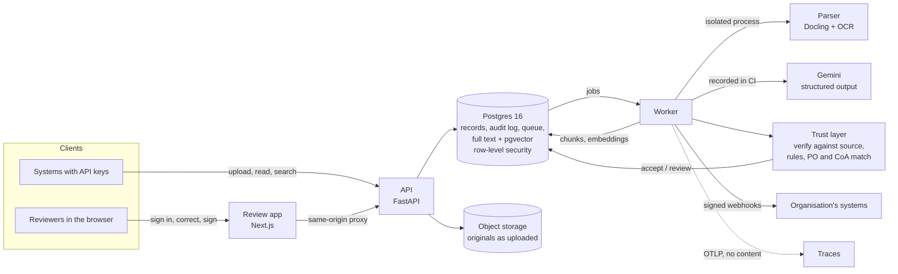

# DocForge

Document intelligence for regulated, document-heavy operations.

DocForge turns PDFs and scans into checked, structured records. Every extracted value links back to
its place on the page, and nothing extracted by a model becomes a record until a rule or a person
accepts it.

**Status:** all nine checkpoints built (see [docs/progress.md](docs/progress.md)).

- Organisations upload invoices, purchase orders and certificates of analysis, born-digital or
  scanned, with API keys.
- Each document is parsed in an isolated process and extracted with the source of every value.
- It is checked against its source, deterministic rules and its related documents, then accepted
  or sent to review.
- Reviewers correct values with reasons and approve under a PIN signature. An approved invoice
  becomes a payment approval draft, delivered by signed webhook.
- Search finds documents by code or meaning, with citations.
- Postgres row-level security keeps organisations apart. Every step is in an append-only,
  hash-chained audit log.
- CI blocks a change that reads worse, and traces and alerts carry no document content.

## Three numbers

| | Measured | On |
| --- | --- | --- |
| Values read correctly, poor scans | **98.1%** (2,424 of 2,472) | 20 synthetic invoices scanned at 110 dpi, 1.8° crooked, blurred; every misread that passed its own checks was stopped by the purchase-order match |
| Defects caught | **15 of 15** | 9 seeded invoice defects (wrong batch, bad arithmetic, expired stock, price above MRP, …) and 6 out-of-limit certificate results |
| Cost and latency per one-page invoice | **$0.0135**, p95 26.6 s | Gemini 3.5 Flash-Lite at its paid price (checked 2026-10-03); the rest of the system adds a p95 of 134 ms per upload under load |

These come from synthetic documents, which are clean and labelled. They show that the system works
and is measured end to end. They are not a claim about anyone's real documents, which is what a
pilot measures. All of them are reproduced offline by `make eval` and held by the CI gate.

## How it works



Design and trade-offs: [docs/architecture.md](docs/architecture.md). What each checkpoint built,
measured and left open: [docs/progress.md](docs/progress.md).

## Try it

**Public demo:** the URL will be published here once it is deployed. The demo runs on synthetic
documents only, and its sign-in page shows a shared account. It resets every night.

**On your machine** (needs Docker, [uv](https://docs.astral.sh/uv/) and `make`; no model key):

```bash
make up                      # Postgres + pgvector and MinIO, migrations
make e2e                     # the whole review in a browser, on recorded documents
```

## Measured in detail

On 20 synthetic pharma invoices (clean, born-digital, one page, two layouts) with
`gemini-3.5-flash-lite`: 2472 of 2472 printed fields correct, and 99.15% of values cite a block
covering their true position. Model latency per invoice: p50 14.4 s, p95 26.6 s.

Trust checks on the same documents plus 9 pairs with one seeded defect each: 9 of 9 defects caught.
Of the 20 correct pairs, 12 were accepted with no review. The other 8 had correct values but a
citation pointing at a neighbouring cell, so they would go to a person.

The same 20 invoices as scans, read by OCR: 2471 of 2472 fields correct on a clean 150 dpi scan,
and 2424 of 2472 (98.06%) on a poor one. On the poor scans, 5 invoices with a misread value passed
their own checks; none of those also agreed with its purchase order.

Three long invoices (45, 80 and 120 lines over 8 pages), read a page at a time: two were fully
correct. The third lost one line where the parser merged two table rows, and its checks sent it to
review. A 301-page invoice parses in its isolated process with a peak of 3.4 GB in 24 minutes on a
laptop CPU.

Certificates of analysis (20 synthetic):
- 511 of 511 values read;
- 6 of 6 out-of-limit results caught;
- 3 of 3 certificates that still claim compliance flagged;
- none of the 14 clean ones flagged.

Search over 60 documents in two organisations:
- **Questions from the tuning set:** hybrid recall@5 is 1.00.
- **Held-out questions:** recall@5 is 0.88, and 0.42 for codes with an OCR-style misread.
- **Unanswerable questions:** hybrid search never answers "nothing found".
- **Across organisations:** no result ever came from the other organisation.

Vector search over 50,000 chunks in ten organisations has a p95 of 21 ms. Under load on a laptop
(300 documents, 5 organisations, model replies replayed), upload p95 is 134 ms and search p95 is
155 ms.

## Development

```bash
make up         # dependencies, Postgres + pgvector, MinIO, migrations
make test       # all tests (integration tests use the services from `make up`)
make lint       # ruff and mypy
make eval       # re-run every eval offline from recordings and rewrite evals/baselines/
make gate       # check the reports against the floors in evals/gate.json
make api        # the API on http://127.0.0.1:8000 (and `make worker` alongside)
make web        # the review app on http://localhost:3000
make load       # load test and vector search at scale
make ops-check  # what in the running system needs a person
make down       # stop the services
```

Every API route needs a credential:

```bash
echo 123456 | uv run python -m docforge.review add-reviewer --admin --name "Your Name" --email you@example.com
KEY=$(uv run python -m docforge.admin create-key --role integrator --name "my system")

curl -H "Authorization: Bearer $KEY" -F "file=@tests/fixtures/synthetic/pair_001/invoice.pdf" \
  http://127.0.0.1:8000/v1/documents                                   # returns the document id
curl -H "Authorization: Bearer $KEY" http://127.0.0.1:8000/v1/documents/<id>/assessment
curl -H "Authorization: Bearer $KEY" "http://127.0.0.1:8000/v1/search?q=XGX944068"
```

Live extraction needs `GEMINI_API_KEY` in `.env`. Settings are listed in
[.env.example](.env.example). The synthetic documents in `tests/fixtures/` are invented, with
ground-truth labels; `make generate` rebuilds them from a fixed seed.

## Deploying

[docs/runbook.md](docs/runbook.md) covers the demo on AWS:
- Terraform in `infra/`;
- the host's Compose stack in `deploy/`;
- images built by the **Images** workflow.

## For regulated use

DocForge is designed to support an organisation's own validation. It is not validated or
certified by itself. [docs/validation/](docs/validation/README.md) has the intended use,
requirements traced to tests, a risk assessment, and how its controls map to 21 CFR Part 11 and
EU GMP Annex 11, gaps included.

## Licence

MIT. See [LICENSE](LICENSE).
